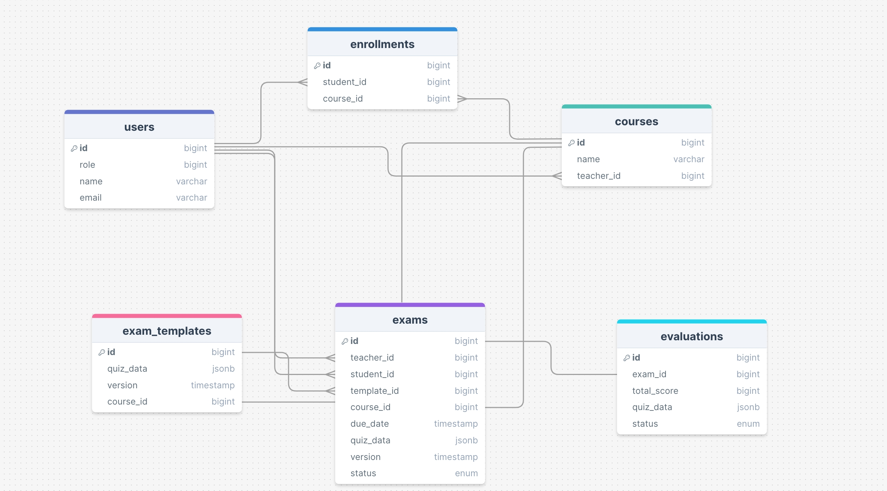

## Quiz - Technical Challenge

#### Summary

This is a technical proposal for an App where we have manage the creation of different exams by an admin.

Although it is explained more in-depth elsewhere, here is the summarized version of the requirements:

- An admin can create exams
- There's 3 types of questions
- Question type 1: Multiple correct answer
- Question type 2: one correct answer
- Question type 3: redaction
- Questions may or not count for the score, and the admin has the ability.
- Exams have a due date.
- An admin can see all the exams completed by a user, with their score

#### Schema Overview



The schema consists of the following main entities:

- **Users**: Represents both teachers and students, differentiated by a role attribute.
- **Courses**: Represents the courses managed by teachers and enrolled in by students.
- **Enrollments**: Represents the many-to-many relationship between users (students) and courses.
- **ExamTemplates**: Represents the blueprint of an exam, including questions and structure.
- **Exams**: Represents specific instances of exams taken by students, based on templates.
- **Evaluations**: Represents the evaluation of an exam by a teacher

### The workflow

With this model this is is how it would work:

1. An admin would go into a screen and they will create an ExamTemlate. They will see the different types of questions and add them as needed inside the column quiz_data
2. Once they are done, an they have submitted the template, an admin will have the ability to create exams for all the students belonging to the course. Specifying as well what is the due date for it. Everything that was defined by the admin in the ExamTemplate will carry over to the individual instances of each student exam.
3. Student will populate the answer attribute for each question inside our quiz_data in Exam
4. If the exam was completed before the due date, the student will be able to submit the exam.
5. Once the exam has been submitted, the admin will evaluate the exam and we will validate that the total score is valid.
6. With the evaluations created, we will be able to see the results of our students and different statistics.

#### Decisions Taken

1. **Single User Model with Roles**
   Although not specified in the requirements, having the student/teacher/courses relationships clearly defined gives a bigger picture of the whole app.

- **Benefits**: Simplifies user management by using a single table for both teachers and students, with a role attribute to differentiate them. Decided to go with an enum as it is easily extensible (maybe we want the distinction between a teacher that can only modifies their courses exams vs an admin that can modify all)

2. **Use of JSONB Columns for Quiz Data**

- **Benefits**: A lot of flexibility and ease to store and retrieve all our quiz-related information, without having to look for it in other tables. Let's say an exam for 1 student has 24 questions, and that we have a class with 100 students. We are looking at 2400 records being created/looked up in a different table vs just using our jsonb column.
- **Disadvantages**: JSONB columns can be less performant, and for querying specific attributes (specially nested) it can be a little tricky.

4. **Versioning the templates**

- **Benefits**: The exam templates are without a doubt subject to change. We added a version column with a timestamp so that we can keep track of it. If we wanted to change some exams, we would definitely be careful of only modifying the ones that we are interested in.

5. **Question templates and not persisting them**

Although we could perhaps have the types of question in a table, there's not that much of a need for it. I liked the idea of just keeping it simple and just defining them as constants in `QuestionTemplate`. The idea would be to use this when adding questions to our `quiz_data`

```rb
class QuestionTemplate
  ONE_CORRECT_ANSWER = {
    type: :one_correct_answer,
    scorable: nil,
    max_score: nil,
    answer_score: nil,
    options: [],
    answer: nil,
    correct_answer: nil
  }


  MULTIPLE_CORRECT_ANSWERS = {
    type: :multiple_correct_answers,
    scorable: nil,
    max_score: nil,
    answer_score: nil,
    options: [],
    answer: nil,
    correct_answers: []
  }

  REDACTION = {
    type: :redaction,
    scorable: nil,
    max_score: nil,
    answer_score: nil,
    answer: nil
  }

  ALL_TYPES = [
    ONE_CORRECT_ANSWER,
    MULTIPLE_CORRECT_ANSWERS,
    REDACTION
  ]
end
```

If a new type of question came along, it would be as easy as changing the code here. And that's not something that would happen very often.

#### Future Developments

- If we were to think what is the part of the app that would be most likely to change, I would say it would be the flexibility when it comes to modifying exams (or more specifically the templates). The curriculum for a course changes, and teachers try to make better exam based on the feedback they receive. Adding new questions and modifying existing ones is a safe bet, and having versions for our templates and a clear separation of concerns is a must.
- As it stands we have one evaluation per exam, but if needed, we could switch over so that 1 exam can have many evaluations. And it wouldn't be hard to change. This is a common practice both in school and university.
- Although not specified, it would be very easy to do automated grading for the answers that were correct for all questions but the redaction ones.

Some questions arise: do we want an admin that manages all AND teachers that only manage their own courses? In what ways exams can change in the future? What kind of statistics are we interested in?

The proposal given is made trying to make things as simple as possible. With as much flexibity as we can, so that we can dig deep into the problem and have the ability to adapt as needed
